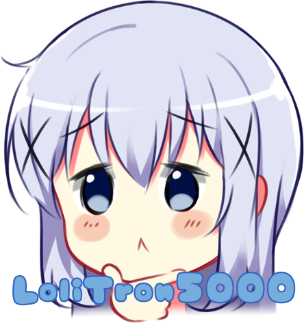

# LoliTron5000

  
 

   

## About:

An AI trained to detect whether an image contains a loli or not.
This AI was developed as part of HenGan, for content filtering and loli protection.
It prevents scenes with loli's to be HenGan'd.
